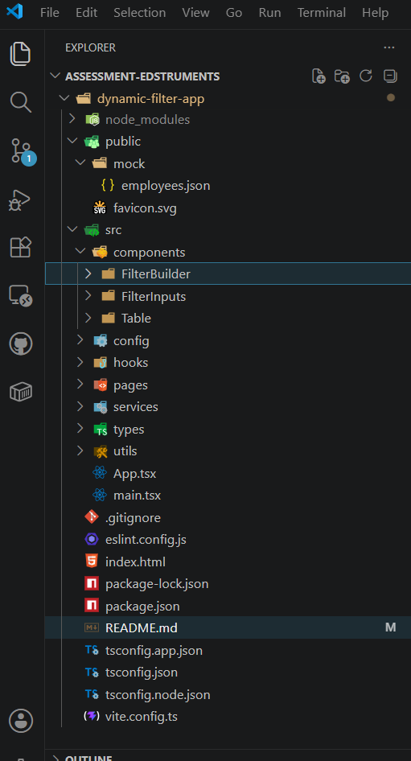

# Dynamic Filter Component System
- A reusable, configuration-driven, type-safe Dynamic Filter Component System built with React 18, TypeScript, Vite, and Material UI.
- The application demonstrates how a single filtering system can be reused across multiple tables without changing its internal implementation by simply providing different field configurations.

# Technologies Used
- React 18
- TypeScript
- Vite
- Material UI
- UUID
- React Hooks
- Lucide React 

# Dynamic Filter Builder
- Add multiple filters dynamically
- Remove individual filters
- Clear all filters
- Real-time filtering
- Configuration-driven architecture
- Reusable across different datasets

# Project Structure


# Reusable Component Architecture
```
components/

FilterBuilder/
│
├── DynamicFilter
├── FilterRow
├── InputRenderer
│
FilterInputs/
│
├── TextInput
├── NumberInput
├── NumberRangeInput
├── DateInput
├── DateRangeInput
├── SelectInput
├── MultiSelectInput
└── BooleanInput
```

# AI Prompts / Development Workflow
- During the development of this assessment, AI assistance was used as a productivity tool for brainstorming, learning concepts, debugging, and improving code quality. All architectural decisions, implementation, testing, and customization were performed by the developer.
1. Workflow – Project Architecture
### Prompt
- Design a reusable, configuration-driven dynamic filter component system using React, TypeScript, and Material UI that can work with multiple tables without modifying internal components.
- Purpose: Designed reusable architecture, Separation of concerns, Component hierarchy, Folder structure

2. Workflow – Type Modeling
### Prompt
- Design type-safe TypeScript interfaces for a reusable filter builder supporting multiple field types and operators.

3. Workflow – Dynamic Input Rendering
### Prompt
- Build a reusable InputRenderer component that dynamically renders different input components based on field configuration.

4. Workflow – Filter Builder
### Prompt
- Create a reusable DynamicFilter component that supports adding, updating, deleting, and clearing filter conditions dynamically.

5. Workflow – Operator Mapping
### Prompt
- Create reusable filtering operators supporting text, numbers, dates, arrays, and boolean values.

6. Workflow – Client-side Filtering
### Prompt
- Design an efficient client-side filtering algorithm supporting multiple filter conditions using AND logic across different fields.

7. Workflow – Number Range Filtering
8. Workflow – Date Range Filtering
9. Workflow – Multi-select Filtering
10. Workflow – Nested Object Filtering
11. Workflow – Employee Table
12. Workflow – Performance Optimization
### Prompt
- Suggest React performance optimizations for client-side filtering with 50 records.
- Purpose: Applied useMemo, Reusable components, Minimal re-renders